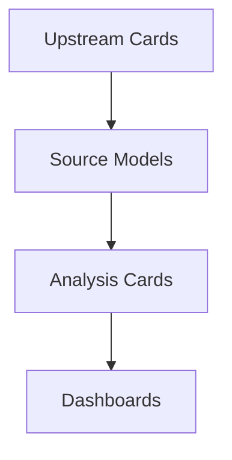

# Metabase Dependencies

Use this file before changing a source model or heavily reused card.

| Card | Name | Upstream | Downstream | Dashboards |
| --- | --- | --- | --- | --- |
| #776 | Reports Flat File All Orders Data By Order Date General Hourly Model | #853 Exchange Rates | #476 SKU订单预警, #781 Overall Refund Rate Over Time, #784 Return Rate By SKU, #791 Sales $ By Product Over Time, #793 Sales U By Product Over Time, #795 出售地区 US, #796 产品订单SKU分布 Pie (NO VINE), #797 产品订单曲线 (NO VINE) Sales Line, #798 产品订单曲线 Per SKU, #799 产品销售曲线 By Day, #800 实时产品销售曲线 (每小时更新), #802 店铺 实际销量, #807 30 Days Sales, #811 补货 Fulfillable Inventory Chart, #841 Amazon Parent SKU 销售比例, #842 Amazon 产品销售比例, #843 Amazon 产品销售比例 Pie By Parent Asin X Color X Size, #844 Amazon 产品销售比例 Pie By Parent Asin X |  |
| #733 | Reports Customer Returns Data Model |  | #744 Sellable Quantity from Returns By SKU X Order, #781 Overall Refund Rate Over Time, #782 Color Returns, #783 Return Parent ASIN Pie, #784 Return Rate By SKU, #785 Return Reason Pie, #786 Returns By Disposition Type, #787 Return SKU Pie, #788 Returns Reason Pivot, #789 Sellable Quantity from Returns By SKU X Order, #928 按SKU全摊薄已售经营表现底表 |  |
| #411 | SB Campaign Model | #413 List SB Campaign Model, #853 Exchange Rates | #458 SB Campaign Video Metrics, #720 SB Campaign CTR, #721 SB Campaign CTR Summarized Trend Line, #722 SB Campaign CTR Pie, #723 SB Campaign CVR, #724 SB Campaign CVR Summarized Trend Line, #725 SB Campaign CVR Pie, #726 SB Campaign ACOS, #727 SB Campaign ACOS Summarized Trend Line, #728 SB Campaign ACOS Pie |  |
| #853 | Exchange Rates |  | #403 Ads SP Campaign Model, #411 SB Campaign Model, #424 SB SearchTerm Model, #425 SB Targeting Model, #703 Ads Sp Searchterm Model, #704 Ads Sp Targeting Model, #742 V Settlement Model, #776 Reports Flat File All Orders Data By Order Date General Hourly Model, #803 SalesAndTrafficByDate Model, #805 Reports Get Fba Myi All Inventory Model |  |
| #403 | Ads SP Campaign Model | #402 List SP Campaign Model, #853 Exchange Rates | #388 Campaign CTR, #705 Campaign CTR Summarized Trend Line, #708 Campaign CTR Pie, #709 Campaign CVR, #710 Campaign CVR Summarized Trend Line, #711 Campaign CVR Pie, #712 Campaign ACOS, #713 Campaign ACOS Pie, #714 Campaign ACOS Summarized Trend Line |  |
| #928 | 按SKU全摊薄已售经营表现底表 | #733 Reports Customer Returns Data Model, #806 库存表, #904 Sold Operating Performance Source (已售经营表现底表) | #929 Cumulative Sold Operating Performance (累计已售经营表现), #932 Cumulative Sold Operating ROI Trend (累计已售经营ROI趋势), #933 Allocated Cost Structure Source (按SKU已分摊成本结构底表), #935 Cumulative Cost + Profit Structure (累计成本结构), #938 Monthly Sold Operating ROI Trend (月度已售经营ROI趋势), #939 Monthly Sold Operating ROI MoM Change (月度已售经营ROI环比变化), #940 Cumulative Net Profit Ranking (累计净利排行), #942 透视图例子111, #943 Monthly Cost-to-Sales Ratio Source (月度成本占销售额比率底表) |  |
| #742 | V Settlement Model | #853 Exchange Rates | #743 Quantity Purchased By Order ID X SKU, #745 Store Profit By SKU X Order Model, #746 Platform Advertisement Cost Over Time, #751 Profit X Cost Analysis SKU Pivot, #801 店铺 实际销售总金额, #896 Amazon Settlement Cost Breakdown (亚马逊结算成本分析表), #904 Sold Operating Performance Source (已售经营表现底表), #914 Amazon Settlement Cost Breakdown (亚马逊结算成本分析表) |  |
| #803 | SalesAndTrafficByDate Model | #853 Exchange Rates | #840 产品页流量+销售转化率 Over Time, #845 SalesAndTrafficByDate Model, Sum of TrafficByDate.sessions, #846 店铺 总用户访问次数, #847 店铺 用户量, #848 店铺 访问次数, #849 店铺 访问/购买 率 |  |
| #402 | List SP Campaign Model |  | #398 Ads SP Gross And Invalids, #403 Ads SP Campaign Model, #703 Ads Sp Searchterm Model, #704 Ads Sp Targeting Model |  |
| #806 | 库存表 | #805 Reports Get Fba Myi All Inventory Model | #811 补货 Fulfillable Inventory Chart, #877 发货基础表, #928 按SKU全摊薄已售经营表现底表 | 补货面板 |
| #836 | Shipment Pricing Model (UI) |  | #685 工厂小合同, #700 DHM 箱单 By SKU, #755 DH 船务小合同, #835 VS 箱单 By SKU |  |
| #873 | 发货 FBA Total Inventory Chart 2.0 | #878 发货 Forecast WOS Summary | #901 工厂补货表2.0, #930 订单 + 发货 + 库存, #931 订单 + 发货 + 库存  透视表 | 补货面板 |
| #413 | List SB Campaign Model |  | #411 SB Campaign Model, #424 SB SearchTerm Model, #425 SB Targeting Model |  |
| #704 | Ads Sp Targeting Model | #402 List SP Campaign Model, #761 List SP Keywords Model DISTINCT, #853 Exchange Rates | #718 Targeting Performance Table, #731 Targeting Negative Performance Table, #763 Targeting Performance Table Test Check |  |
| #745 | Store Profit By SKU X Order Model | #621 AVG Production & Shipment Cost By SKU, #742 V Settlement Model, #743 Quantity Purchased By Order ID X SKU, #744 Sellable Quantity from Returns By SKU X Order | #752 Store Profit Over Time New, #888 Actual Store Revenue X Production & Shipment Costs Over Time Model, #893 ROI Per Sku Base Model |  |
| #777 | Parent SKU Natural Sales Daily Model |  | #778 Bar - Natural sales, #779 Combo - Natural Sales Daily Over Time, #780 Line - Natural Sales Daily By Parent SKU |  |
| #933 | Allocated Cost Structure Source (按SKU已分摊成本结构底表) | #928 按SKU全摊薄已售经营表现底表 | #934 Monthly Cost Mix Trend (月度成本占比趋势), #936 Total Cost Mix (总成本占比), #937 Monthly Cost MoM Growth Trend (月度成本环比增幅趋势) |  |
| #425 | SB Targeting Model | #413 List SB Campaign Model, #853 Exchange Rates | #730 SB Targeting Performance Table, #732 SB Targeting Negative Performance Table |  |
| #621 | AVG Production & Shipment Cost By SKU |  | #745 Store Profit By SKU X Order Model, #904 Sold Operating Performance Source (已售经营表现底表) |  |
| #700 | DHM 箱单 By SKU | #836 Shipment Pricing Model (UI) | #701 DHM 箱单 By Product Group | DHM 箱单 |
| #743 | Quantity Purchased By Order ID X SKU | #742 V Settlement Model | #745 Store Profit By SKU X Order Model, #904 Sold Operating Performance Source (已售经营表现底表) |  |
| #744 | Sellable Quantity from Returns By SKU X Order | #733 Reports Customer Returns Data Model | #745 Store Profit By SKU X Order Model, #904 Sold Operating Performance Source (已售经营表现底表) |  |
| #761 | List SP Keywords Model DISTINCT |  | #703 Ads Sp Searchterm Model, #704 Ads Sp Targeting Model |  |
| #807 | 30 Days Sales | #776 Reports Flat File All Orders Data By Order Date General Hourly Model | #811 补货 Fulfillable Inventory Chart, #877 发货基础表 |  |
| #835 | VS 箱单 By SKU | #836 Shipment Pricing Model (UI) | #837 VS 箱单 By Product Group | VS 箱单 |
| #876 | Wps Sales Forecast By Day |  | #878 发货 Forecast WOS Summary, #879 未来有效日销model |  |
| #877 | 发货基础表 | #776 Reports Flat File All Orders Data By Order Date General Hourly Model, #806 库存表, #807 30 Days Sales, #870 SKU First Sale Date | #878 发货 Forecast WOS Summary, #879 未来有效日销model |  |
| #878 | 发货 Forecast WOS Summary | #876 Wps Sales Forecast By Day, #877 发货基础表, #899 Wps Shipment Model, #900 Wps Shipment Items Model | #873 发货 FBA Total Inventory Chart 2.0, #921 清仓表 |  |
| #904 | Sold Operating Performance Source (已售经营表现底表) | #621 AVG Production & Shipment Cost By SKU, #742 V Settlement Model, #743 Quantity Purchased By Order ID X SKU, #744 Sellable Quantity from Returns By SKU X Order | #906 Cost Structure Source (成本结构底表), #928 按SKU全摊薄已售经营表现底表 |  |
| #943 | Monthly Cost-to-Sales Ratio Source (月度成本占销售额比率底表) | #928 按SKU全摊薄已售经营表现底表 | #948 Monthly Cost-to-Sales Ratio (月度成本占销售额比率), #949 Cost Pivot Table by Store & Marketplace (按店铺成本透视表) |  |
| #313 | Purchase Quantity Distribution by State |  |  | 亚马逊用户肖像分布 |
| #314 | Purchase Amount and Quantity Distribution by Race |  |  | 亚马逊用户肖像分布 |
| #388 | Campaign CTR | #403 Ads SP Campaign Model |  | SP Ads Monitoring |
| #424 | SB SearchTerm Model | #413 List SB Campaign Model, #719 List SB Keywords Model, #853 Exchange Rates | #729 SB SearchTerm Performance Table |  |
| #458 | SB Campaign Video Metrics | #411 SB Campaign Model |  | SB Ads Monitoring |
| #585 | Shipping Cost Over Time |  | #757 Shipping Cost Sum Over Time New |  |
| #625 | FBA Shipment 表 Metric Unit (CA) |  |  | FBA 模板 |
| #676 | 工厂大合同 |  |  | VS工厂合同 |
| #685 | 工厂小合同 | #836 Shipment Pricing Model (UI) |  | VS工厂合同 |
| #686 | FBA Shipment 表 Imperial Unit (US) |  |  | FBA 模板 |
| #701 | DHM 箱单 By Product Group | #700 DHM 箱单 By SKU |  | DHM 箱单 |
| #703 | Ads Sp Searchterm Model | #402 List SP Campaign Model, #761 List SP Keywords Model DISTINCT, #853 Exchange Rates | #715 SearchTerm Performance Table |  |
| #705 | Campaign CTR Summarized Trend Line | #403 Ads SP Campaign Model |  | SP Ads Monitoring |
| #708 | Campaign CTR Pie | #403 Ads SP Campaign Model |  | SP Ads Monitoring |
| #709 | Campaign CVR | #403 Ads SP Campaign Model |  | SP Ads Monitoring |
| #710 | Campaign CVR Summarized Trend Line | #403 Ads SP Campaign Model |  | SP Ads Monitoring |
| #711 | Campaign CVR Pie | #403 Ads SP Campaign Model |  | SP Ads Monitoring |
| #712 | Campaign ACOS | #403 Ads SP Campaign Model |  | SP Ads Monitoring |
| #713 | Campaign ACOS Pie | #403 Ads SP Campaign Model |  | SP Ads Monitoring |
| #714 | Campaign ACOS Summarized Trend Line | #403 Ads SP Campaign Model |  | SP Ads Monitoring |
| #715 | SearchTerm Performance Table | #703 Ads Sp Searchterm Model |  | SP Ads Monitoring |
| #718 | Targeting Performance Table | #704 Ads Sp Targeting Model |  | SP Ads Monitoring |
| #719 | List SB Keywords Model |  | #424 SB SearchTerm Model |  |
| #720 | SB Campaign CTR | #411 SB Campaign Model |  | SB Ads Monitoring |
| #721 | SB Campaign CTR Summarized Trend Line | #411 SB Campaign Model |  | SB Ads Monitoring |
| #722 | SB Campaign CTR Pie | #411 SB Campaign Model |  | SB Ads Monitoring |
| #723 | SB Campaign CVR | #411 SB Campaign Model |  | SB Ads Monitoring |
| #724 | SB Campaign CVR Summarized Trend Line | #411 SB Campaign Model |  | SB Ads Monitoring |
| #725 | SB Campaign CVR Pie | #411 SB Campaign Model |  | SB Ads Monitoring |
| #726 | SB Campaign ACOS | #411 SB Campaign Model |  | SB Ads Monitoring |
| #727 | SB Campaign ACOS Summarized Trend Line | #411 SB Campaign Model |  | SB Ads Monitoring |
| #728 | SB Campaign ACOS Pie | #411 SB Campaign Model |  | SB Ads Monitoring |
| #729 | SB SearchTerm Performance Table | #424 SB SearchTerm Model |  | SB Ads Monitoring |
| #730 | SB Targeting Performance Table | #425 SB Targeting Model |  | SB Ads Monitoring |
| #731 | Targeting Negative Performance Table | #704 Ads Sp Targeting Model |  | SP Ads Monitoring |
| #732 | SB Targeting Negative Performance Table | #425 SB Targeting Model |  | SB Ads Monitoring |
| #754 | Production Cost Over Time New |  | #888 Actual Store Revenue X Production & Shipment Costs Over Time Model |  |
| #755 | DH 船务小合同 | #836 Shipment Pricing Model (UI) |  | DHM 合同 |
| #756 | Shipping Cost Over Time New |  | #888 Actual Store Revenue X Production & Shipment Costs Over Time Model |  |
| #778 | Bar - Natural sales | #777 Parent SKU Natural Sales Daily Model |  | Natural Sales |
| #779 | Combo - Natural Sales Daily Over Time | #777 Parent SKU Natural Sales Daily Model |  | Natural Sales |
| #780 | Line - Natural Sales Daily By Parent SKU | #777 Parent SKU Natural Sales Daily Model |  | Natural Sales |
| #781 | Overall Refund Rate Over Time | #733 Reports Customer Returns Data Model, #776 Reports Flat File All Orders Data By Order Date General Hourly Model |  | Returns |
| #782 | Color Returns | #733 Reports Customer Returns Data Model |  | Returns |
| #784 | Return Rate By SKU | #733 Reports Customer Returns Data Model, #776 Reports Flat File All Orders Data By Order Date General Hourly Model |  | Returns |
| #785 | Return Reason Pie | #733 Reports Customer Returns Data Model |  | Returns |
| #786 | Returns By Disposition Type | #733 Reports Customer Returns Data Model |  | Returns |
| #788 | Returns Reason Pivot | #733 Reports Customer Returns Data Model |  | Returns |
| #793 | Sales U By Product Over Time | #776 Reports Flat File All Orders Data By Order Date General Hourly Model |  | Store Monitor Dashboard |
| #795 | 出售地区 US | #776 Reports Flat File All Orders Data By Order Date General Hourly Model |  | Store Monitor Dashboard |
| #796 | 产品订单SKU分布 Pie (NO VINE) | #776 Reports Flat File All Orders Data By Order Date General Hourly Model |  | Store Monitor Dashboard |
| #797 | 产品订单曲线 (NO VINE) Sales Line | #776 Reports Flat File All Orders Data By Order Date General Hourly Model |  | Store Monitor Dashboard |
| #800 | 实时产品销售曲线 (每小时更新) | #776 Reports Flat File All Orders Data By Order Date General Hourly Model |  | Store Monitor Dashboard |
| #801 | 店铺 实际销售总金额 | #742 V Settlement Model |  | Store Monitor Dashboard |
| #802 | 店铺 实际销量 | #776 Reports Flat File All Orders Data By Order Date General Hourly Model |  | Store Monitor Dashboard |
| #805 | Reports Get Fba Myi All Inventory Model | #853 Exchange Rates | #806 库存表 |  |
| #837 | VS 箱单 By Product Group | #835 VS 箱单 By SKU |  | VS 箱单 |
| #840 | 产品页流量+销售转化率 Over Time | #803 SalesAndTrafficByDate Model |  | Store Monitor Dashboard |
| #846 | 店铺 总用户访问次数 | #803 SalesAndTrafficByDate Model |  | Store Monitor Dashboard |
| #847 | 店铺 用户量 | #803 SalesAndTrafficByDate Model |  | Store Monitor Dashboard |
| #848 | 店铺 访问次数 | #803 SalesAndTrafficByDate Model |  | Store Monitor Dashboard |
| #849 | 店铺 访问/购买 率 | #803 SalesAndTrafficByDate Model |  | Store Monitor Dashboard |
| #852 | 出售地区 CA | #776 Reports Flat File All Orders Data By Order Date General Hourly Model |  | Store Monitor Dashboard |
| #870 | SKU First Sale Date | #776 Reports Flat File All Orders Data By Order Date General Hourly Model | #877 发货基础表 |  |
| #871 | Cumulative Settlement & Inventory Investment Trend (累计结算与库存投入趋势) | #888 Actual Store Revenue X Production & Shipment Costs Over Time Model |  | Settlement & Inventory Investment (实时结算与库存投入看板） |
| #874 | 产品订单曲线 Per SKU (NO VINE) | #776 Reports Flat File All Orders Data By Order Date General Hourly Model |  | 补货面板 |
| #879 | 未来有效日销model | #876 Wps Sales Forecast By Day, #877 发货基础表 | #880 未来日销趋势 |  |
| #885 | Shipping Cost Over Time By Sku |  | #893 ROI Per Sku Base Model |  |
| #886 | Production Cost Over Time By Sku |  | #893 ROI Per Sku Base Model |  |
| #888 | Actual Store Revenue X Production & Shipment Costs Over Time Model | #745 Store Profit By SKU X Order Model, #754 Production Cost Over Time New, #756 Shipping Cost Over Time New | #871 Cumulative Settlement & Inventory Investment Trend (累计结算与库存投入趋势) |  |
| #896 | Amazon Settlement Cost Breakdown (亚马逊结算成本分析表) | #742 V Settlement Model |  | Cost (成本看板) |
| #899 | Wps Shipment Model |  | #878 发货 Forecast WOS Summary |  |
| #900 | Wps Shipment Items Model |  | #878 发货 Forecast WOS Summary |  |
| #901 | 工厂补货表2.0 | #873 发货 FBA Total Inventory Chart 2.0 |  | 补货面板 |
| #919 | Sales QTY & Dollar |  |  | VIP专属数据面板 |
| #920 | 产品订单曲线 Cum Sales QTY Per SKU (NO VINE) | #776 Reports Flat File All Orders Data By Order Date General Hourly Model |  | 补货面板 |
| #929 | Cumulative Sold Operating Performance (累计已售经营表现) | #928 按SKU全摊薄已售经营表现底表 |  | Sold Contribution Profit Dashboard (已售贡献利润看板) |
| #932 | Cumulative Sold Operating ROI Trend (累计已售经营ROI趋势) | #928 按SKU全摊薄已售经营表现底表 |  | Sold Contribution Profit Dashboard (已售贡献利润看板) |
| #934 | Monthly Cost Mix Trend (月度成本占比趋势) | #933 Allocated Cost Structure Source (按SKU已分摊成本结构底表) |  | Cost (成本看板) |
| #935 | Cumulative Cost + Profit Structure (累计成本结构) | #928 按SKU全摊薄已售经营表现底表 |  | Cost (成本看板) |
| #936 | Total Cost Mix (总成本占比) | #933 Allocated Cost Structure Source (按SKU已分摊成本结构底表) |  | Cost (成本看板) |
| #937 | Monthly Cost MoM Growth Trend (月度成本环比增幅趋势) | #933 Allocated Cost Structure Source (按SKU已分摊成本结构底表) |  | Cost (成本看板) |
| #938 | Monthly Sold Operating ROI Trend (月度已售经营ROI趋势) | #928 按SKU全摊薄已售经营表现底表 |  | Sold Contribution Profit Dashboard (已售贡献利润看板) |
| #939 | Monthly Sold Operating ROI MoM Change (月度已售经营ROI环比变化) | #928 按SKU全摊薄已售经营表现底表 |  | Sold Contribution Profit Dashboard (已售贡献利润看板) |
| #940 | Cumulative Net Profit Ranking (累计净利排行) | #928 按SKU全摊薄已售经营表现底表 |  | Sold Contribution Profit Dashboard (已售贡献利润看板) |
| #948 | Monthly Cost-to-Sales Ratio (月度成本占销售额比率) | #943 Monthly Cost-to-Sales Ratio Source (月度成本占销售额比率底表) |  | Cost (成本看板) |
| #949 | Cost Pivot Table by Store & Marketplace (按店铺成本透视表) | #943 Monthly Cost-to-Sales Ratio Source (月度成本占销售额比率底表) |  | Cost (成本看板) |
| #950 | 下单量 |  |  | 补货面板 |
